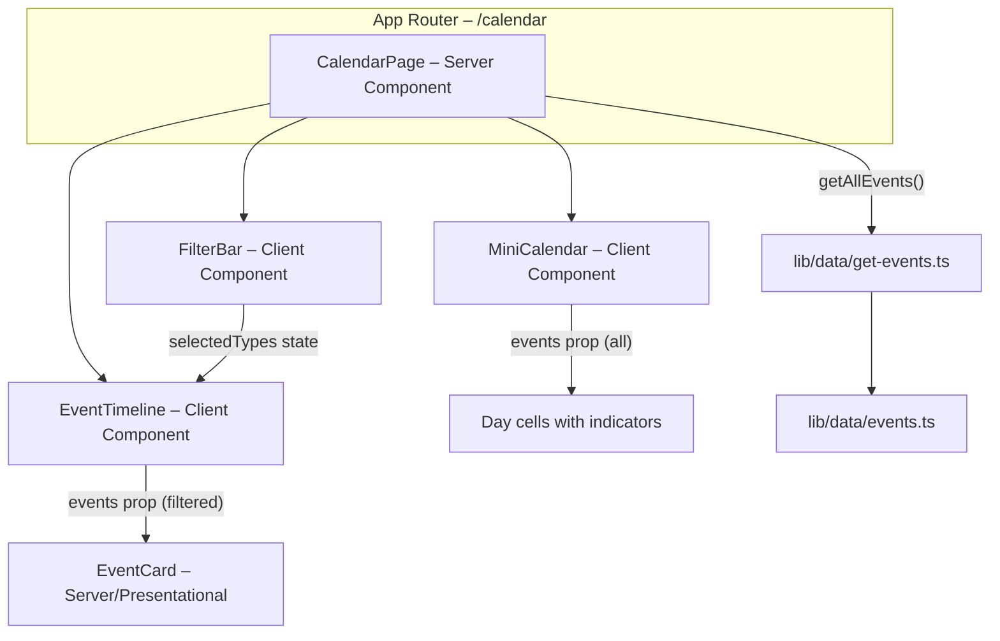

# Design Document: Calendar Page Shell

## Overview

The Calendar Page Shell adds a `/calendar` route to the Orlando Devs web app that lets community members browse events in chronological order, filter by event type, and glance at a mini month-view calendar with day-level event indicators.

The page is a **static shell** — it renders the existing placeholder event dataset (`lib/data/events.ts`) through the data-access layer (`lib/data/get-events.ts`) without requiring an API or database. Interactive behaviors (filter toggling, today highlight) are handled client-side via React state.

### Key Design Decisions

| Decision                                                               | Rationale                                                                                                                                                                      |
| ---------------------------------------------------------------------- | ------------------------------------------------------------------------------------------------------------------------------------------------------------------------------ |
| Server Component for data loading, Client Components for interactivity | Leverages Next.js 16 App Router defaults — minimal JS shipped for the static event list; client bundle only where state is needed (filter bar, mini calendar today highlight). |
| No external calendar library                                           | Requirements explicitly forbid it; the mini calendar is a simple 7×6 grid generated from `Date` math.                                                                          |
| `md:` breakpoint (768px) for responsive switch                         | Matches the existing `useIsMobile` hook default and the breakpoint used in the navbar.                                                                                         |
| Zinc palette dark theme                                                | Consistent with the homepage hero section and existing CSS variables (`--background`, `--foreground`).                                                                         |
| Placeholder logo element on Event Cards                                | Mirrors the homepage hero skeleton cards (`bg-white/5 border border-white/10 rounded-xl`) but substitutes real event title/date text.                                          |

---

## Architecture



### Component Hierarchy

```
app/calendar/page.tsx  (Server Component – fetches data, composes layout)
└── CalendarShell (Client Component – owns filter state, renders children)
    ├── FilterBar (renders filter chips, emits selectedTypes)
    ├── EventTimeline (receives filtered events)
    │   └── EventCard × N (presentational)
    └── MiniCalendar (receives all events for dot indicators)
```

**Why a wrapper `CalendarShell` Client Component?**
The filter state needs to be shared between `FilterBar` and `EventTimeline`. Lifting it to a client-boundary wrapper keeps the page-level component a Server Component (so data fetching has zero client cost) while coordinating interactivity below.

---

## Components and Interfaces

### `CalendarPage` (Server Component)

**File:** `apps/web/app/calendar/page.tsx`

```typescript
// Server component — no "use client"
import { getAllEvents } from '@/lib/data/get-events'
import { CalendarShell } from '@/components/calendar/calendar-shell'

export default function CalendarPage() {
  const events = getAllEvents()
  return (
    <section className="bg-zinc-950 text-white py-10 lg:py-16 min-h-screen">
      <div className="max-w-7xl mx-auto px-4 sm:px-6 lg:px-8">
        <CalendarShell events={events} />
      </div>
    </section>
  )
}
```

---

### `CalendarShell` (Client Component)

**File:** `apps/web/components/calendar/calendar-shell.tsx`

```typescript
'use client'

interface CalendarShellProps {
  events: Event[]
}
```

Responsibilities:

- Owns `selectedTypes: Set<EventType>` state (initially empty = show all).
- Derives `filteredEvents` from props + state.
- Renders the two-column grid (`md:grid-cols-[2fr_1fr]`).
- Passes `filteredEvents` to `EventTimeline`, all events to `MiniCalendar`.

---

### `FilterBar`

**File:** `apps/web/components/calendar/filter-bar.tsx`

```typescript
'use client'

interface FilterBarProps {
  selectedTypes: Set<EventType>
  onToggle: (type: EventType) => void
}
```

Renders a horizontal row of toggle chips — one per `EventType`. Each chip toggles on/off. When no chips are selected, all events pass through.

Chip styles:

- Default: `bg-zinc-900 border border-zinc-800 text-zinc-400`
- Selected: `bg-zinc-800 border border-zinc-600 text-white`

---

### `EventTimeline`

**File:** `apps/web/components/calendar/event-timeline.tsx`

```typescript
interface EventTimelineProps {
  events: Event[]
}
```

Presentational list:

- Maps over `events` (already sorted by `getAllEvents`).
- Renders one `EventCard` per event.
- Displays empty state (`"No events to show"`) when `events.length === 0`.

---

### `EventCard`

**File:** `apps/web/components/calendar/event-card.tsx`

```typescript
interface EventCardProps {
  event: Event
}
```

Structure:

```
┌──────────────────────────────────────────┐
│ [44×44 logo placeholder]  Title          │
│                           Date · Time    │
└──────────────────────────────────────────┘
```

Styles: `bg-zinc-900/80 border border-zinc-800 rounded-xl p-4 flex items-center gap-4`

Logo placeholder: `w-11 h-11 rounded-md bg-white/10` (renders nothing if `group.logo` is empty string — requirement 7.4).

---

### `MiniCalendar`

**File:** `apps/web/components/calendar/mini-calendar.tsx`

```typescript
'use client'

interface MiniCalendarProps {
  events: Event[]
}
```

Renders:

1. Month/year heading (e.g., "June 2026").
2. Weekday header row (S M T W T F S).
3. 6×7 grid of day cells.
4. Today highlight via `ring-2 ring-[#5B4FE9]` or similar accent.
5. Event indicator dot (`w-1.5 h-1.5 rounded-full bg-[#5B4FE9]`) on dates with events.
6. Leading/trailing days dimmed (`text-zinc-700`).

Calendar math uses plain `Date`:

- First day of month → `getDay()` gives offset.
- Total days → `new Date(year, month, 0).getDate()`.
- Leading days filled from previous month; trailing days fill remaining cells in the last row.

---

## Data Models

### Existing Types (no changes)

```typescript
// lib/types/event.ts
interface Event {
  id: string
  title: string
  description: string
  sponsors: Sponsor[]
  date: string // "YYYY-MM-DD"
  time: string
  location: string
  eventType: EventType
  registrationUrl: string
  sourcePlatform: SourcePlatform
  group: CommunityGroup
  tags: string[]
  featured: boolean
}

type EventType = 'meetup' | 'workshop' | 'conference' | 'hackathon' | 'webinar' | 'social' | 'other'
```

### Filter State (new, client-only)

```typescript
// Inside CalendarShell
const [selectedTypes, setSelectedTypes] = useState<Set<EventType>>(new Set())
```

### Derived Data

```typescript
const filteredEvents =
  selectedTypes.size === 0 ? events : events.filter(e => selectedTypes.has(e.eventType))
```

### Calendar Grid Model

```typescript
interface DayCell {
  date: number // day of month (1-31)
  isCurrentMonth: boolean
  isToday: boolean
  hasEvents: boolean
}
```

Generated per-render from `events` prop and current date. No persistence needed.

---

## Correctness Properties

_A property is a characteristic or behavior that should hold true across all valid executions of a system — essentially, a formal statement about what the system should do. Properties serve as the bridge between human-readable specifications and machine-verifiable correctness guarantees._

### Property 1: Filter produces correct subset

_For any_ list of events and _for any_ non-empty subset of `EventType` values selected as filters, the filtered result shall contain exactly the events whose `eventType` is a member of the selected set — no extras, no omissions. When the selected set is empty, all events pass through unfiltered.

**Validates: Requirements 2.4, 2.5**

### Property 2: Events are sorted chronologically

_For any_ list of events returned by the timeline, each event's date (and time, for same-date events) shall be less than or equal to the next event's date/time — i.e., the list is in non-decreasing chronological order.

**Validates: Requirements 3.1**

### Property 3: Event card renders title and date/time for any event

_For any_ valid `Event` object (including those with empty `group.logo`, empty `group.discordUrl`, and empty `sponsors` array), rendering the `EventCard` component shall produce output that contains both the event's `title` text and its `date`/`time` text, and shall not throw a runtime error.

**Validates: Requirements 4.2, 4.3, 7.2**

### Property 4: Calendar grid structure and boundary correctness

_For any_ valid year and month (1–12), the generated calendar grid shall have exactly 7 columns, contain every day number from 1 to the last day of that month exactly once as current-month cells, and mark all cells before day 1 and after the last day as non-current-month (leading/trailing) cells.

**Validates: Requirements 5.1, 5.5**

### Property 5: Calendar heading format

_For any_ valid year and month, the calendar heading shall be the full English month name followed by a space and the four-digit year (e.g., "January 2024", "December 2030").

**Validates: Requirements 5.2**

### Property 6: Event indicators match event dates

_For any_ set of events and _for any_ month grid, a day cell shall have `hasEvents: true` if and only if at least one event in the set has a `date` falling on that calendar day within the displayed month.

**Validates: Requirements 5.3**

---

## Error Handling

| Scenario                     | Handling                                                                                                                                 |
| ---------------------------- | ---------------------------------------------------------------------------------------------------------------------------------------- |
| `events` array is empty      | `EventTimeline` renders an empty-state message. `MiniCalendar` renders the grid with no indicators.                                      |
| `group.logo` is empty string | `EventCard` conditionally skips the `<Image>` element and renders only the placeholder div.                                              |
| `sponsors` array is empty    | `EventCard` omits the sponsors section entirely (no empty container rendered).                                                           |
| Invalid date string in event | `getAllEvents()` sort uses `new Date(date).getTime()` — invalid dates sort to `NaN`. Defensive: filter out `NaN` dates before rendering. |
| Month with 6-row overflow    | Grid always renders a fixed 6-row × 7-column layout; trailing cells fill remaining spaces.                                               |

---

## Testing Strategy

### Unit Tests (example-based)

| Test                                        | Validates         |
| ------------------------------------------- | ----------------- |
| Page renders FilterBar above columns        | Req 1.2, 2.1      |
| FilterBar renders 7 event-type chips        | Req 2.2           |
| All chips unselected by default             | Req 2.3           |
| Empty event list shows empty-state message  | Req 3.4           |
| EventCard placeholder logo is 44×44 rounded | Req 4.1           |
| EventCard horizontal flex layout            | Req 4.5           |
| Today's date has highlight class            | Req 5.4           |
| Mobile single-column stacking order         | Req 6.1, 6.2, 6.3 |
| Card count matches dataset length           | Req 7.1, 7.3      |
| Empty logo → no img element                 | Req 7.4           |
| Empty sponsors → no sponsors section        | Req 7.5           |

### Property-Based Tests

Library: **fast-check** (via Vitest)

Each property test runs a minimum of **100 iterations** with randomized inputs.

| Test                                             | Property   | Tag                                                                                            |
| ------------------------------------------------ | ---------- | ---------------------------------------------------------------------------------------------- |
| Filter produces correct subset                   | Property 1 | Feature: calendar-page-shell, Property 1: Filter produces correct subset                       |
| Events are sorted chronologically                | Property 2 | Feature: calendar-page-shell, Property 2: Events are sorted chronologically                    |
| Event card renders title and date/time           | Property 3 | Feature: calendar-page-shell, Property 3: Event card renders title and date/time for any event |
| Calendar grid structure and boundary correctness | Property 4 | Feature: calendar-page-shell, Property 4: Calendar grid structure and boundary correctness     |
| Calendar heading format                          | Property 5 | Feature: calendar-page-shell, Property 5: Calendar heading format                              |
| Event indicators match event dates               | Property 6 | Feature: calendar-page-shell, Property 6: Event indicators match event dates                   |

### Testing Approach

- **Unit tests** cover concrete DOM structure, styling classes, and integration with the existing data layer.
- **Property tests** validate the pure logic functions (filtering, sorting, grid generation, formatting) that can be extracted and tested independently of React rendering.
- The pure logic for grid generation, filtering, and formatting will be extracted into utility functions (`lib/calendar/`) so property tests can exercise them without mounting components.
