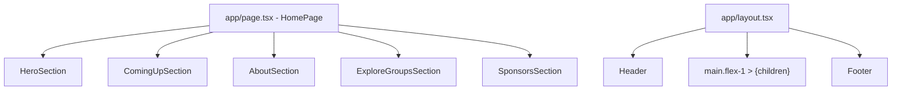

# Design Document: Homepage Sections

## Overview

This design guides the refactoring of `app/page.tsx` from its current inline CSS approach (a large `<style>` block with custom properties and vanilla CSS classes) to Tailwind CSS utility classes. The goal is design-system compliance with the existing Header and Footer components while preserving the same five-section structure, semantic markup, and placeholder content.

**Key Design Decision:** The refactoring is a styling migration, not a structural rewrite. The existing component decomposition (HeroSection, ComingUpSection, AboutSection, ExploreGroupsSection, SponsorsSection) is sound and should be preserved. The `styles` constant and all custom CSS class names will be removed entirely.

**Coaching Approach:** This document provides Why/Where/How guidance for each section so the developer can implement the Tailwind conversion themselves.

## Architecture

### Component Structure



**Why this architecture:**

- The layout already wraps `{children}` in a `<main className="flex-1">` element. The current `page.tsx` renders its own `<main id="main-content">` inside layout's `<main>`, creating a nested `<main>` — a semantic HTML violation. The refactored page should remove its own `<main>` wrapper and render sections directly as siblings.
- Each section remains a separate function component in the same file for now. Extraction to `components/` is deferred to a future story since there's no reuse yet.

### Design Tokens Mapping

The inline CSS uses custom properties (`--color-ink`, `--color-accent`, etc.) that need mapping to Tailwind's zinc scale and the project's established patterns:

| Inline CSS Token             | Tailwind Equivalent         | Rationale                         |
| ---------------------------- | --------------------------- | --------------------------------- |
| `--color-ink` (#0D1117)      | `zinc-950`                  | Matches Header/Footer bg          |
| `--color-ink-soft` (#1C2333) | `zinc-900`                  | Card backgrounds in dark contexts |
| `--color-surface` (#F6F8FA)  | `zinc-50` or `zinc-100`     | Light section backgrounds         |
| `--color-white`              | `white`                     | Direct mapping                    |
| `--color-accent` (#5B4FE9)   | `[#5B4FE9]` arbitrary value | Brand purple — no zinc equivalent |
| `--color-cta` (#FF6B35)      | `[#FF6B35]` arbitrary value | Brand orange CTA                  |
| `--color-muted` (#6B7A99)    | `zinc-500`                  | Subdued text                      |
| `--color-border` (#E2E6EF)   | `zinc-200`                  | Light borders                     |
| `--color-placeholder-bg`     | `zinc-100`                  | Skeleton fills                    |
| `--color-placeholder-text`   | `zinc-400`                  | Skeleton text                     |

**Design Decision:** Brand colors (`accent`, `cta`) don't exist in the zinc scale. Use Tailwind arbitrary values `bg-[#5B4FE9]` and `bg-[#FF6B35]` to keep them inline without extending the theme. This avoids `tailwind.config` changes and keeps the approach consistent with how Header uses `bg-[#5865F2]` for Discord purple.

### Container Pattern

All sections use the same container pattern established in Header and Footer:

```
max-w-7xl mx-auto px-4 sm:px-6 lg:px-8
```

This replaces the old `.container` class with its CSS-custom-property-driven `max-width` and `clamp()` padding.

## Components and Interfaces

### Page Component (Server Component)

```typescript
// app/page.tsx — default export, no "use client" needed
export default function HomePage() {
  return (
    <>
      <HeroSection />
      <ComingUpSection />
      <AboutSection />
      <ExploreGroupsSection />
      <SponsorsSection />
    </>
  );
}
```

**Why no `<main>` wrapper:** The layout already provides `<main className="flex-1">`. Removing the duplicate `<main>` fixes the semantic nesting issue.

### Section Component Interface (implicit, not exported)

Each section function follows the same contract:

- Returns a `<section>` with `id` and `aria-labelledby`
- Contains a container div with the standard max-width pattern
- Uses only Tailwind utility classes (no `className="eyebrow"` etc.)
- Renders placeholder content with `aria-hidden="true"` on decorative elements

### Responsive Breakpoint Strategy

| Viewport            | Tailwind Prefix | Grid Behavior          |
| ------------------- | --------------- | ---------------------- |
| ≤ 768px (mobile)    | default / `sm:` | Single column, stacked |
| 769–1024px (tablet) | `md:`           | 2-column grids         |
| > 1024px (desktop)  | `lg:`           | 3–4 column grids       |

This matches Header's `hidden md:flex` pattern and Footer's `flex-col md:flex-row`.

## Data Models

This feature has no data persistence or external data fetching. All content is static placeholder. The implicit "data" is the section configuration:

### Section Registry (conceptual)

```typescript
// Not a runtime data model — describes the fixed structure
type SectionId = 'hero' | 'coming-up' | 'about' | 'explore-groups' | 'sponsors'

interface SectionDefinition {
  id: SectionId
  headingId: string // e.g., "hero-heading"
  headingLevel: 'h1' | 'h2'
  component: () => JSX.Element
}
```

### Placeholder Data Arrays

Event types, group cards, sponsor tiers, and value cards are small inline arrays (already present in the current implementation). No external data source is needed.

## Correctness Properties

_A property is a characteristic or behavior that should hold true across all valid executions of a system — essentially, a formal statement about what the system should do. Properties serve as the bridge between human-readable specifications and machine-verifiable correctness guarantees._

### Property 1: Static UI — no applicable property-based tests

_For any_ static page with no programmatic input variation, no data transformations, and no algorithmic logic, property-based testing provides no additional value over example-based tests. This feature renders identical output on every invocation — there are no inputs to vary. All acceptance criteria are verifiable with single-render DOM assertions and browser-based E2E tests.

**Validates: Requirements 1.1, 1.2, 1.3, 1.4, 2.1, 2.2, 2.3, 2.4, 3.1, 3.2, 3.3, 3.4, 4.1, 4.2, 4.3, 4.4, 5.1, 5.2, 5.3, 5.4, 5.5, 6.1, 6.2, 6.3**

## Error Handling

This feature has minimal error conditions since it renders static placeholder content with no data fetching, user input, or external dependencies.

### Potential Error Scenarios

| Scenario                                 | Handling Strategy                                                                                                               |
| ---------------------------------------- | ------------------------------------------------------------------------------------------------------------------------------- |
| Missing image assets (logo, discord.svg) | Already handled by `` fallback behavior; not a concern for homepage sections since placeholders use CSS shapes, not images |
| Invalid URL fragment (Req 2.4)           | Browser native behavior — no JS error. Page stays at default scroll position. No custom error handling needed                   |
| CSS class typos                          | Caught at dev time via visual inspection. No runtime error                                                                      |
| Future: dynamic data fetch failure       | Out of scope for this story. Placeholder content ensures sections always render (Req 1.3)                                       |

### Smooth-Scroll Implementation

**Why:** Requirement 2.3 asks for smooth-scroll on fragment navigation.  
**Where:** `app/globals.css` (the only permitted location for global styles).  
**How:** Add `scroll-behavior: smooth` to the `html` element, respecting `prefers-reduced-motion`:

```css
html {
  scroll-behavior: smooth;
}

@media (prefers-reduced-motion: reduce) {
  html {
    scroll-behavior: auto;
  }
}
```

This is a CSS-only solution — no JavaScript scroll handlers needed. Browsers natively handle fragment navigation when `scroll-behavior: smooth` is set.

## Testing Strategy

### Why Property-Based Testing Does NOT Apply

This feature is a **static UI rendering** refactoring with no programmatic input variation:

- The page always renders the same 5 sections with the same placeholder content
- There are no user inputs, data transformations, or algorithmic logic
- Running any test 100 times produces identical results
- All acceptance criteria are verifiable with a single render + DOM assertions

Property-based testing would add no value here. The appropriate testing strategies are **example-based unit tests** (DOM structure) and **integration/E2E tests** (responsive behavior, scroll).

### Testing Approach

#### 1. Component Unit Tests (DOM Structure)

**Why:** Verify semantic structure, accessibility attributes, section order, and placeholder counts — all without needing a real browser.  
**Where:** A test file alongside the page, e.g. `app/page.test.tsx`  
**How:** Use React Testing Library with its render + query utilities.

**Test cases (example-based):**

| Test                                                                  | Validates Requirement |
| --------------------------------------------------------------------- | --------------------- |
| Renders exactly 5 `<section>` elements in correct DOM order           | 1.1, 2.1              |
| Each section has unique `id` matching defined set                     | 2.1, 2.2              |
| Each section has `aria-labelledby` referencing its heading            | 1.4, 6.1              |
| Hero contains exactly one `<h1>`; others use `<h2>`                   | 6.2                   |
| Decorative skeleton elements have `aria-hidden="true"`                | 4.4, 6.3              |
| Each section contains at least one visible text label                 | 4.1                   |
| Coming Up, About, Explore Groups, Sponsors have ≥ 2 placeholder items | 4.3                   |
| Container divs use `max-w-7xl mx-auto px-4 sm:px-6 lg:px-8` classes   | 5.3                   |

#### 2. Static Analysis / Code Review Checks

**Why:** Several requirements are implementation constraints (no CSS modules, zinc-only colors, correct breakpoint prefixes). These are best verified by code review or lint rules, not runtime tests.  
**Validates:** 5.1, 5.2, 5.4, 5.5, 3.2

**Checks:**

- No `<style>` tags in the rendered output
- No `.module.css` imports
- No inline `style` props (except where Tailwind arbitrary values are needed)
- Only `sm:`, `md:`, `lg:` breakpoint prefixes used
- Color classes are from zinc scale or arbitrary brand values

#### 3. E2E / Integration Tests (Browser-Required)

**Why:** Responsive layout, scroll behavior, and overflow can only be verified in a real browser environment.  
**Where:** `e2e/homepage.spec.ts` (Playwright or similar)  
**Validates:** 2.3, 2.4, 3.1, 3.3, 3.4

**Test cases:**

| Test                                   | Viewport           | Assertion                     |
| -------------------------------------- | ------------------ | ----------------------------- |
| Fragment navigation scrolls to section | Desktop            | Target section is in viewport |
| Invalid fragment stays at top          | Desktop            | Scroll position is 0          |
| Grid columns collapse on mobile        | 375px              | Cards stack single-column     |
| Grid shows 2 columns on tablet         | 800px              | Grid has 2 columns            |
| Grid shows 3–4 columns on desktop      | 1280px             | Grid has 3+ columns           |
| No horizontal scrollbar                | 320px–1920px sweep | scrollWidth ≤ clientWidth     |
| Body text ≥ 16px on mobile             | 375px              | Computed font-size ≥ 16       |

#### 4. Visual Snapshot Tests (Optional)

**Why:** Catch unintended visual regressions during the CSS-to-Tailwind migration.  
**Where:** Same E2E framework with screenshot comparison.  
**How:** Capture page screenshots at 3 breakpoints before and after refactoring.

### Test Framework Recommendations

- **Unit tests:** Vitest + React Testing Library (already compatible with Next.js App Router)
- **E2E tests:** Playwright (natural fit for Next.js, good viewport control)
- **Snapshots:** Playwright's built-in screenshot comparison

### Implementation Guidance Per Section

Below is the Why/Where/How coaching for each section's Tailwind conversion:

---

### Hero Section Refactoring Guide

**Why:** The Hero currently uses ~25 custom CSS classes. It needs dark background, gradient overlays, a 2-column grid (desktop) collapsing to 1-column (mobile), and placeholder cards.

**Where:** The `HeroSection` function in `app/page.tsx`.

**How (pattern):**

- Section container: `bg-zinc-950 text-white py-16 lg:py-28 overflow-hidden relative`
- Gradient overlay: Use a `<div>` with `absolute inset-0 pointer-events-none` and Tailwind's gradient utilities or an arbitrary `bg-[radial-gradient(...)]`
- Inner grid: `relative grid grid-cols-1 lg:grid-cols-2 gap-12 items-center`
- Badge: `inline-flex items-center gap-2 bg-[#5B4FE9]/20 border border-[#5B4FE9]/40 rounded-full px-3.5 py-1.5 text-sm font-semibold text-[#A89EF6] mb-6`
- Headline: `text-4xl lg:text-7xl font-extrabold leading-tight tracking-tight`
- Stats row: `flex gap-8 mt-12 pt-8 border-t border-white/10`
- Visual column (placeholder cards): `hidden lg:flex flex-col gap-4` (hidden on mobile per current behavior)

---

### Coming Up Section Refactoring Guide

**Why:** Event cards in a 3-column grid (desktop), 2 (tablet), 1 (mobile). Light background with border-bottom.

**Where:** The `ComingUpSection` function.

**How (pattern):**

- Section: `bg-white py-16 lg:py-28 border-b border-zinc-200`
- Header row: `flex flex-col md:flex-row md:items-end md:justify-between gap-6 mb-12`
- Event grid: `grid grid-cols-1 md:grid-cols-2 lg:grid-cols-3 gap-6`
- Event card: `border border-zinc-200 rounded-xl overflow-hidden`
- Card image placeholder: `h-40 bg-zinc-100`
- Card body: `p-5`
- Tag: `inline-block bg-[#EAE8FD] text-[#5B4FE9] rounded px-2.5 py-0.5 text-xs font-bold uppercase tracking-wide`

---

### About Section Refactoring Guide

**Why:** 2-column layout (text + visual) with value cards in a 2×2 grid. Light surface background.

**Where:** The `AboutSection` function.

**How (pattern):**

- Section: `bg-zinc-50 py-16 lg:py-28`
- Inner grid: `grid grid-cols-1 lg:grid-cols-2 gap-10 lg:gap-20 items-center`
- Value cards grid: `mt-9 grid grid-cols-1 sm:grid-cols-2 gap-4`
- Value card: `bg-white border border-zinc-200 rounded-xl p-5`
- Visual placeholder: `h-60 lg:h-96 bg-zinc-100 rounded-xl flex items-center justify-center text-zinc-400 text-sm font-semibold`

---

### Explore Groups Section Refactoring Guide

**Why:** 4-column group cards (desktop), 2 (tablet), 1 (mobile). Similar structure to Coming Up.

**Where:** The `ExploreGroupsSection` function.

**How (pattern):**

- Section: `bg-white py-16 lg:py-28 border-b border-zinc-200`
- Group grid: `grid grid-cols-1 md:grid-cols-2 lg:grid-cols-4 gap-5`
- Group card: `border border-zinc-200 rounded-xl p-5 flex flex-col gap-3.5`
- Avatar placeholder: `w-13 h-13 rounded-full bg-zinc-100`
- Card footer: `flex justify-between items-center mt-1 pt-3.5 border-t border-zinc-200`

---

### Sponsors Section Refactoring Guide

**Why:** Centered layout with tiered logo rows. Light surface background. CTA at bottom.

**Where:** The `SponsorsSection` function.

**How (pattern):**

- Section: `bg-zinc-50 py-12 lg:py-20`
- Header: `text-center mb-12`
- Tier label: `text-xs font-bold uppercase tracking-widest text-zinc-500 text-center mb-6`
- Logo row: `flex justify-center items-center gap-6 flex-wrap`
- Logo placeholder (gold): `w-44 h-18 border border-zinc-200 rounded-md bg-white flex items-center justify-center text-zinc-400 text-xs font-semibold`
- CTA area: `text-center mt-12 pt-10 border-t border-zinc-200`

---

### Shared Patterns

**Eyebrow label** (replaces the `.eyebrow` CSS class):

```
inline-flex items-center gap-2 text-xs font-bold uppercase tracking-widest text-[#5B4FE9] border-l-[3px] border-[#5B4FE9] pl-2.5 mb-5
```

**Primary button** (replaces `.btn-primary`):

```
bg-[#FF6B35] hover:bg-[#D9531E] text-white rounded-md px-7 py-3.5 text-sm font-bold transition-colors
```

**Ghost button** (replaces `.btn-ghost`):

```
bg-transparent text-zinc-400 border border-zinc-600 hover:text-white hover:border-zinc-400 rounded-md px-7 py-3.5 text-sm font-semibold transition-colors
```

### Key Migration Steps (Summary)

1. Remove the entire `styles` constant and the commented `<style>{styles}</style>` tag
2. Remove the `<main id="main-content">` wrapper (layout provides `<main>`)
3. Remove `Eyebrow` and `PlaceholderBlock` helper components (replace with inline Tailwind classes)
4. Convert each section's custom CSS classes to Tailwind utilities following the patterns above
5. Add `scroll-behavior: smooth` to `globals.css`
6. Remove any leftover `style={{...}}` inline props (convert to Tailwind equivalents)
7. Verify all `aria-labelledby`, `aria-hidden`, heading levels are preserved
